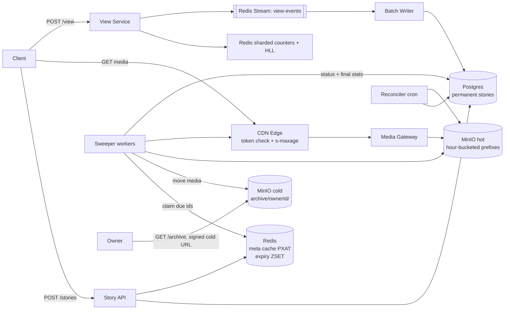

# Dusk

Dusk is a hackathon submission for the Problem Statement PS-15: Instagram Stories with a 24-hour disappearing-content lifecycle.

## Problem summary

A story must become inaccessible exactly 24 hours after posting, even when it receives high traffic. The system must protect the public access rule without losing the owner's archive history. The key is to separate logical expiry from physical handling.

## Product rule and lifecycle

- Public access blocks at `T + 24h` for all viewers.
- The owner keeps the story in a private archive by default.
- Owners may add stories to Highlights.
- Expiry means loss of access; it does not mean loss of data.
- Lifecycle: `ACTIVE -> ARCHIVED -> PURGED` and `DELETED` as a tombstone before expiry.

### State model

- `ACTIVE`: 0 to 24h, audience check applies.
- `ARCHIVED`: after 24h, public access returns `410 Gone`; owner-only archive access remains.
- `PURGED`: owner deletes from archive, account deletion, or archive disabled at expiry. Media physically removed.
- `DELETED`: manual delete before 24h; tombstone with 30-day undo default and physical purging later.

## Design principle

The Dusk hybrid uses three layers:

1. Read-path check: every access validates `now < expires_at` and checks state.
2. TTL everywhere: Redis `PXAT`, signed URLs, CDN ephemeral caching, object lifecycle rules.
3. Sweeper + reconciler: catch missed transitions and repair drift.

No single mechanism guarantees exact 24h expiry with scale. The hybrid is necessary because correctness and cleanup need different guarantees.

## Architecture



## Scale assumptions and math

All assumptions are explicit and marked as assumptions. Numbers below are used for demo sizing and design argument, not measured from a production deployment.

- Stories/day: 100M/day => 1,157/s average, ~5,000/s peak.
- Story views/day: 10B/day => 115,741/s average, ~500,000/s peak.
- Average blended media size: 3 MB.
- Rendition multiplier: 2.5x.
- Archive-on percentage: 80% of stories kept in archive, assumption.
- TTL: default 86,400 seconds (24h); demo mode uses 120 seconds.

### 24h hot storage

$$
(100M \times 3MB \times 2.5) \div 24 \approx 31.25GB/h
$$

This is the rough hot-objects working set, assuming most stories are served quickly within the first 24h.

### CDN egress

$$
10B\ views/day \times 3MB \times 2.5 \approx 75,000\ GB/day
$$

This is a back-of-envelope number for object delivery and is a reason to prefer short-lived signed URLs and CDN caching for the hot tier.

### Redis memory for counters + HLL

Assume one story has ~1,000 unique viewers on average and 5,000 plays. Storing counters in shards and HLLs is manageable in Redis because the number of active stories is bounded by the rolling 24h window.

### Sweeper throughput

A 24h system needs to move expired stories at approximately the same rate as they expire. At 1,157 stories/s average and 5,000/s peak, the sweeper must sustain backlog recovery with a queue and retries.

### Archive growth

Assuming 80% archive-on and 100M stories/day:

$$
100M \times 0.8 \times 3MB \times 2.5 \approx 600GB/day
$$

Annualized:

$$
600GB/day \times 365 \approx 219TB/year
$$

Mitigations:
- keep one rendition + thumbnail in archive
- archive on cold storage class
- optional retention cap after N years
- compress and deduplicate highlight copies

## Expiry design and media strategy

### Logical expiry vs physical deletion

- Logical expiry is enforced by `expires_at` in the read path.
- Physical handling is a separate sweeper action that moves media to archive or deletes it.
- This is why the rule can be enforced reliably without losing archive history.

### Storage layout

Hot media lives at prefixes like:

- `stories/{expiryHourBucket}/{storyId}/{rendition}`

After transition it moves to:

- `archive/{ownerId}/{storyId}/...`

Cold storage never appears in the public CDN cache. Public media URLs are signed and time-limited. Archive access uses owner-only signed URLs with no public caching.

### TTL and CDN behavior

- Redis caches story metadata with expiry at `expires_at`.
- CDN caches use `s-maxage` equal to the remaining lifetime.
- Signed URL expiration is `min(expires_at, now + 15min)`.
- These three layers cooperate so cached objects cannot be served after the token dies.

## Read path

`GET /stories/{id}` is strongly consistent.

Rules:
- `requester != owner` and (`now >= expires_at` or `status != ACTIVE`) => `410 Gone`
- `requester == owner` and `status == ARCHIVED` => archive view
- `status == PURGED` => `404` or `410`
- audience check is enforced with public, follower, and close-friend rules

Headers:
- `Cache-Control: public, s-maxage=<remaining>, max-age=<min(remaining,60)>`
- Archive responses use `private, no-store`

## Write path

`POST /stories`:
- upload to `stories/{expiryHourBucket}/{storyId}/{rendition}`
- insert row with `created_at = now()`, `expires_at = created_at + TTL`, `status = ACTIVE`
- append to `expiry_queue` using `ZADD`
- set Redis metadata cache with `PXAT expires_at`

## Expiry pipeline

### Sweeper

The sweeper claims due items from the `expiry_queue` using a Lua script that atomically leases keys. For each story it idempotently:

1. sets `ARCHIVED` or `PURGED`
2. moves media to cold storage if archiving is enabled
3. deletes all renditions if purging
4. flushes final counters to `story_stats_final`
5. upserts `archive_items`
6. best-effort CDN purge of hot path and Redis cleanup

Retries use exponential backoff and a dead-letter queue.

### Reconciler

Running every five minutes, it finds:
- `ACTIVE` rows with `expires_at < now - grace`
- orphaned hot objects
- missing archive objects
- Redis/DB drift

It repairs drift and reports metrics.

### Partitioning and retention

- `stories` is permanent and partitioned by month.
- `story_views` is day-partitioned and dropped after retention (default 48h after expiry, explicit assumption).
- `story_stats_final` stays forever for aggregate reporting.

## View counting

`POST /stories/{id}/view` is idempotent per `(storyId, viewerId)` and returns `202` immediately.

- Total plays: sharded counters in Redis (`views:{storyId}:{0..N-1}`) with shard = `hash(viewerId) % N`.
- Unique viewers: HyperLogLog (`PFADD uniq:{storyId}`), approximate with 0.8% error.
- Exact viewer list: goes to a Redis stream -> batch writer -> PostgreSQL `story_views`.
- Accept a view only if `server_receive_time <= expires_at + 60s`.
- On expiry: final metrics are reconciled and stored in `story_stats_final`.

This yields eventually consistent live counts with exact final numbers after settlement.

## Clock handling

- Single time authority: DB `now()`
- NTP-synced hosts
- skew budget <= 100 ms
- p99 latency target <= 1 s
- Multi-region story ownership uses absolute UTC expiry times, without extending them on replicas

## Privacy and deletion model

- Public access ends at `T+24h`.
- Physical deletion occurs for owner delete, account deletion, or archive-off flows.
- Archive media is never served through the public CDN cache.
- Target deletion SLA for `PURGED` records is <= 1h; hard cap is 48h for orphan hot objects.

## Observability

The prototype exposes `/metrics` and includes:
- expiry lag
- active-but-expired rows
- orphaned hot objects
- missing archive objects
- counter drift
- stream lag
- sweeper retries and dead-letter queue
- CDN token rejections

## Data model and SQL DDL

This is the reference schema for the production design. The prototype keeps the same logical model in memory for demo purposes.

```sql
CREATE TABLE users (
  id UUID PRIMARY KEY,
  handle TEXT NOT NULL UNIQUE,
  archive_enabled BOOLEAN NOT NULL DEFAULT true,
  created_at TIMESTAMPTZ NOT NULL DEFAULT now()
);

CREATE TABLE stories (
  id UUID PRIMARY KEY,
  owner_id UUID NOT NULL REFERENCES users(id),
  media_keys TEXT[] NOT NULL,
  audience TEXT NOT NULL CHECK (audience IN ('PUBLIC', 'FOLLOWERS', 'CLOSE_FRIENDS')),
  status TEXT NOT NULL CHECK (status IN ('ACTIVE', 'ARCHIVED', 'PURGED', 'DELETED')),
  created_at TIMESTAMPTZ NOT NULL DEFAULT now(),
  expires_at TIMESTAMPTZ NOT NULL,
  archive_enabled BOOLEAN NOT NULL DEFAULT true,
  deleted_at TIMESTAMPTZ,
  INDEX idx_stories_owner_created (owner_id, created_at DESC),
  INDEX idx_stories_status_expires (status, expires_at)
) PARTITION BY RANGE (created_at);

CREATE TABLE story_views (
  story_id UUID NOT NULL,
  viewer_id UUID NOT NULL,
  viewed_at TIMESTAMPTZ NOT NULL DEFAULT now(),
  PRIMARY KEY (story_id, viewer_id)
) PARTITION BY RANGE (viewed_at);

CREATE TABLE story_stats_final (
  story_id UUID PRIMARY KEY,
  total_plays BIGINT NOT NULL,
  unique_viewers BIGINT NOT NULL,
  finalized_at TIMESTAMPTZ NOT NULL DEFAULT now()
);

CREATE TABLE archive_items (
  story_id UUID PRIMARY KEY,
  owner_id UUID NOT NULL,
  cold_key TEXT NOT NULL,
  thumb_key TEXT NOT NULL,
  archived_at TIMESTAMPTZ NOT NULL DEFAULT now()
);

CREATE TABLE highlights (
  id UUID PRIMARY KEY,
  owner_id UUID NOT NULL REFERENCES users(id),
  title TEXT NOT NULL,
  cover_key TEXT NOT NULL
);

CREATE TABLE highlight_items (
  highlight_id UUID NOT NULL REFERENCES highlights(id),
  story_id UUID NOT NULL,
  position INT NOT NULL,
  media_copy_key TEXT NOT NULL,
  PRIMARY KEY (highlight_id, story_id)
);

CREATE TABLE close_friends (
  owner_id UUID NOT NULL,
  friend_id UUID NOT NULL,
  PRIMARY KEY (owner_id, friend_id)
);

CREATE TABLE follows (
  follower_id UUID NOT NULL,
  followee_id UUID NOT NULL,
  PRIMARY KEY (follower_id, followee_id)
);
```

## API contracts and sample requests

```http
POST /stories
Content-Type: application/json

{
  "ownerId": "owner-1",
  "audience": "PUBLIC",
  "archiveEnabled": true,
  "title": "Sunset walk"
}
```

```json
{
  "status": 201,
  "story": {
    "id": "story-123",
    "status": "ACTIVE",
    "expiresAt": 1733400000000
  },
  "media": {
    "url": "https://cdn.dusk.demo/...",
    "expiresAt": 1733399400000
  }
}
```

```http
POST /stories/123/view
Content-Type: application/json

{ "viewerId": "viewer-42" }
```

```json
{ "status": 202, "accepted": true, "summary": { "totalPlays": 51, "uniqueViewers": 49 } }
```

```http
GET /stories/123
```

```json
{
  "status": 200,
  "story": { "id": "123", "status": "ACTIVE" },
  "expiresInMs": 163840
}
```

## Edge cases covered

The automated tests exercise the following conditions:

1. view at T+23:59:59.9 vs expiry race
2. video playing across the deadline
3. manual delete before 24h
4. sweeper crash mid-transition
5. Redis flush/restart
6. hot story with cache stampede
7. same viewer repeated views
8. close-friend story after expiry
9. leaked/bookmarked media URL after expiry
10. wrong client clock
11. owner vs follower link behavior
12. archive-disabled story
13. highlight copy survives original archive deletion
14. account deletion cascade

## Trade-off table

| Approach | Precision | Compute cost | Storage cost | Risk | Privacy | Complexity |
| --- | --- | --- | --- | --- | --- | --- |
| Immediate deletion / per-story timer | High | High | Low | Missed timers create drift | Strong | High |
| Lazy expiry / check-on-access | Medium | Low | High | Read-path extra work and stale caches | Moderate | Medium |
| TTL-based storage expiry | Medium | Low | Medium | Data may vanish too soon or too late | Good for media only | Medium |
| Dusk hybrid | High | Medium | Medium | Low with reconciler | Strong | Higher |

The hybrid wins because the read path enforces correctness, TTL reduces cost, and sweeper/reconciler repair failures. Archiving does not break the 24h rule because logical expiry is enforced before physical handling.

## API contracts

Documented in the code and usage examples, including:

- `POST /stories`
- `GET /stories/{id}`
- `DELETE /stories/{id}`
- `GET /stories/tray`
- `POST /stories/{id}/view`
- `GET /stories/{id}/viewers?cursor=`
- `GET /stories/{id}/stats`
- `GET /archive?cursor=`
- `GET /archive/{storyId}`
- `DELETE /archive/{storyId}`
- `POST /highlights`
- `POST /highlights/{id}/items`
- `GET /highlights/{userId}`
- `PATCH /me/settings`
- `GET /metrics`
- `POST /admin/chaos/{action}`

## UX design

Dusk uses a dark-first, mobile-first language with a dusk gradient and a story countdown life ring. Every screen is designed for mobile and includes empty, loading, and error states.

## Deliverables in this repo

- Design document: this README
- Prototype backend and frontend demo
- Automated tests for the 14 edge cases
- k6 load-test simulation
- Demo script: DEMO.md
- Pitch outline: pitch-outline.md

## Running locally

This repo is designed for Docker Compose with the default 120s TTL demo mode.

```bash
docker compose up --build
```

The stack includes Postgres, Redis, MinIO, the API service, the sweeper, the reconciler, and the React frontend.

## Assumptions and disclaimers

- `VIEWER_LIST_RETENTION` default is 48h after expiry as a design assumption.
- Real Instagram-scale behavior depends on stricter compliance, sharded Postgres, Kafka, CloudFront, object lifecycle policies, and regional routing.
- This prototype is a demo that captures the engineering principle and demonstrates the hybrid model in a manageable form.
